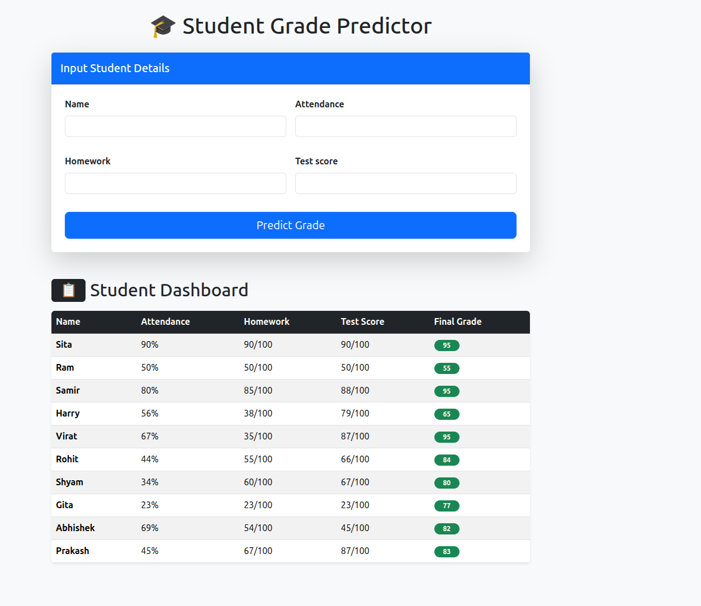
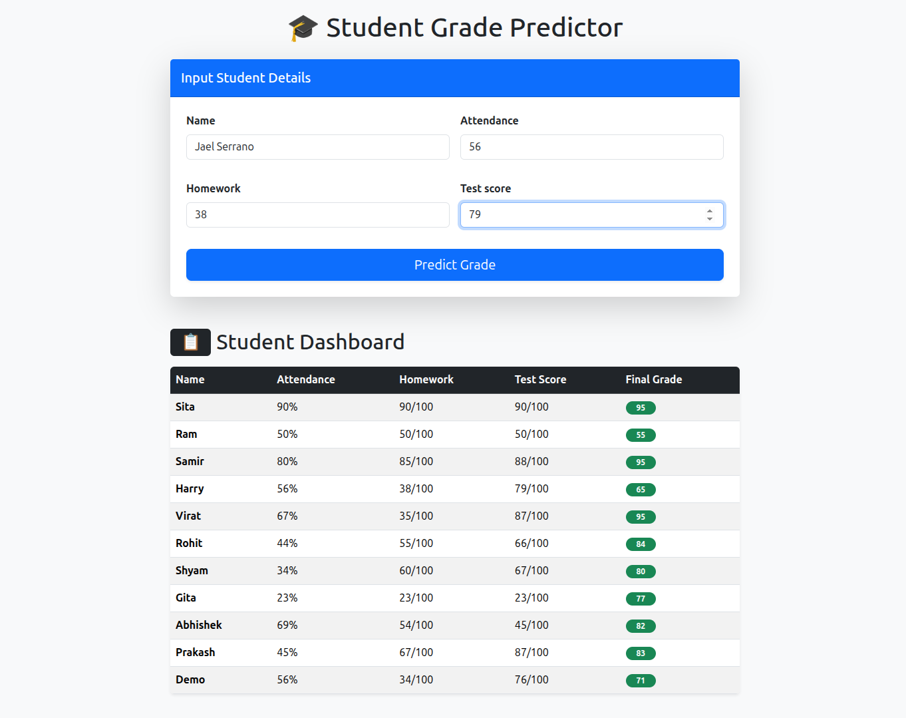
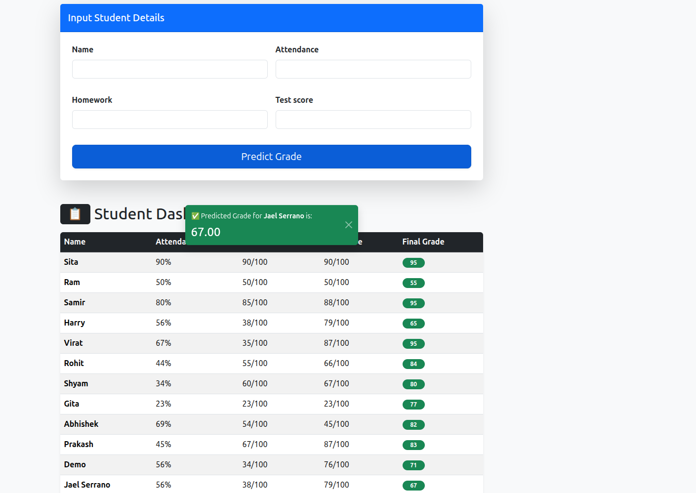
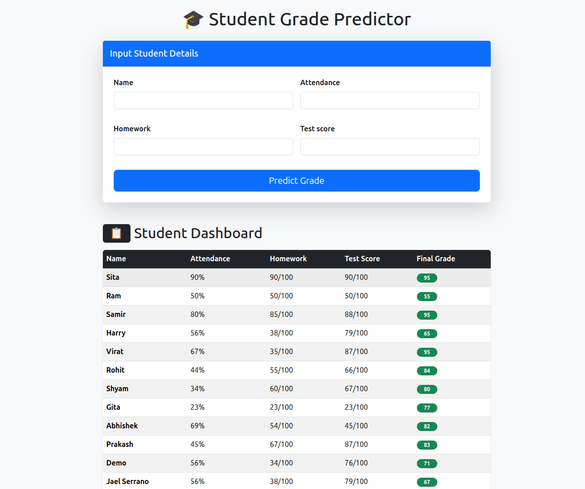

# Simple Supervised Learning Model (Grade Predictor)

An educational machine learning project built with Django and scikit-learn to predict student final grades based on their academic participation and performance.

## 🚀 Overview

This project implements a **Supervised Learning Model** using a **Random Forest Regressor** to estimate a student's final grade. It takes three key features as input:

- **Attendance Percentage**
- **Homework Score**
- **Test Score**

The system can be used both as a web application and as a standalone analysis script.

## 🛠️ Technologies Used

- **Backend:** Django 6.0.2
- **Machine Learning:** scikit-learn 1.8.0, Pandas 3.0.0, NumPy 2.4.2
- **Database:** SQLite
- **Utilities:** joblib (for model persistence potential)

## ✨ Key Features

- **Educational Grade Prediction:** Predicts final grades using historical data trends.
- **Interactive Web Interface:** A user-friendly form for entering student data and seeing immediate predictions.
- **Student Dashboard:** View a complete history of all students, their inputs, and their predicted/actual grades.
- **Standalone ML Script:** `ml_model.py` provides a direct way to train, evaluate (R² Score), and test the models without the web interface.
- **Automatic Data Persistence:** Predicted grades and student inputs are automatically saved to the database.

## �️ Screenshots

### Grade Prediction Dashboard



### Prediction Results



### Student Records History



### Student Records History



## 🔧 Setup & Installation

### 1. Clone the Repository

```bash
git clone https://github.com/sameer9860/Simple-Supervised-Learning-Model.git
cd Simple-Supervised-Learning-Model then again cd SupervisedLearningModule
```

### 2. Set up a Virtual Environment

```bash
python -m venv venv
source venv/bin/activate(Linux/Mac)     # On Windows: venv\Scripts\activate
```

### 3. Install Dependencies

```bash
pip install -r requirements.txt
```

### 4. Run Migrations

```bash
python manage.py migrate
```

### 5. Start the Development Server

```bash
python manage.py runserver
```

The application will be available at `http://127.0.0.1:8000/`.

## 📖 How to Use

1. **Access the Predictor:** Navigate to the home page (`/`).
2. **Enter Data:** Fill in the student's name, attendance, homework, and test scores.
3. **Get Prediction:** Click "Predict" to see the estimated final grade.
4. **View Dashboard:** Scroll down to see the list of all previous predictions stored in the database.

---

_Created for the "AI in Education" module._
